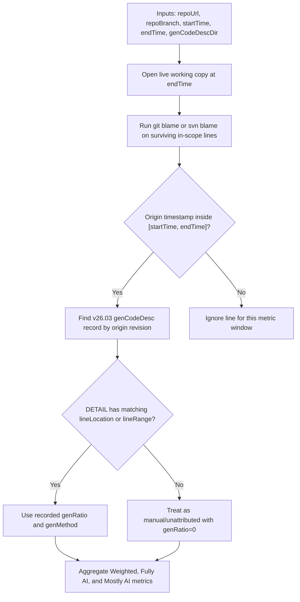
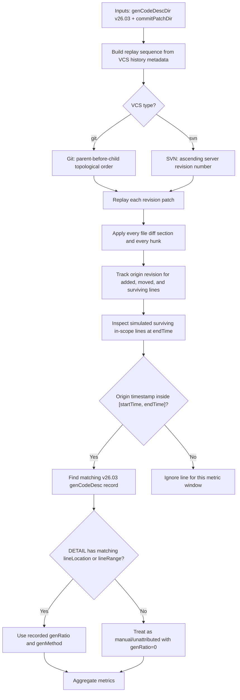
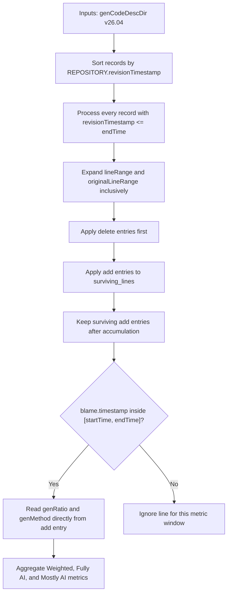

# Algorithm A, B, and C — WHAT & WHY

## ======>>>SHARED GOAL<<<======

All three algorithms answer the **same question**:

> For the in-scope code or document lines that survive in the logical repository snapshot at `endTime`, and whose current text form was introduced by a revision timestamp inside `[startTime, endTime]`, how much is attributable to AI?

The algorithms differ in **how they discover line origins** -- not in what they measure. Scope selection decides whether the result is code-only, document-only, or both; the line-origin rule stays the same.

---

## ======>>>ONE-GLANCE COMPARISON<<<======

| | **Algorithm A** | **Algorithm B** | **Algorithm C** |
| --- | --- | --- | --- |
| **Core technique** | Live VCS blame at `endTime` | Ordered offline diff replay | Embedded VCS blame in genCodeDesc |
| **Repository access at runtime** | Required for blame | Not required if ordered patches and order metadata are supplied | Not required |
| **genCodeDesc version** | v26.03 | v26.03 | v26.04 |
| **Needs per-commit diff patch** | No | Yes | No |
| **Processing order authority** | Live `endTime` snapshot | VCS history order | `REPOSITORY.revisionTimestamp` |
| **Correctness authority** | Live VCS blame | Rebuilt line lineage from patches | Real VCS blame captured by codeAgent at write time |
| **Production status** | Production quality | Narrow paths active | Planned |

---

## ======>>>ALGORITHM A — Blame-Based End-Snapshot Attribution<<<======

### A: WHAT It Is

Algorithm A is the **primary, production-quality baseline**. It starts from the live file snapshot at `endTime`, runs `git blame` or `svn blame` on every surviving in-scope line, and uses the blame result to discover which revision last introduced the current text form of that line. Lines whose origin revision timestamp falls inside `[startTime, endTime]` are counted. For each counted line, it looks up `genRatio` from the matching per-revision genCodeDesc v26.03 record; if the sparse v26.03 `DETAIL` has no matching line entry, the line is treated as manual/unattributed with effective `genRatio=0`.

### A: Flow Diagram



### A: WHY It Works

- **Directly answers the P0 metric** on the live snapshot.
- Rename and move detection is handled by **mature VCS blame implementations** when the selected VCS and options support it.
- Low logical risk: blame is the **authoritative source** of line origin — no partial reconstruction needed.
- Works for both Git and SVN.

### A: Known Pitfalls

- Requires **live repository access** -- a local checkout or equivalent working copy must be present at runtime.
- Blame performance can be slow on **very large repositories** with many large files.
- Correctness depends on VCS blame quality — SVN with complex mergeinfo may return imprecise results.
- A v26.03 record must exist for every counted origin revision to produce exact attribution; otherwise the configured missing-record policy applies.

---

## ======>>>ALGORITHM B — Incremental Lineage Reconstruction Without Blame<<<======

### B: WHAT It Is

Algorithm B replays an ordered sequence of **per-revision unified-diff patches** from `--commitPatchDir` to reconstruct line ownership incrementally. Instead of asking the VCS "who last changed this line?", it simulates the history by applying diffs in VCS history order and tracking which revision introduced each surviving line. Once a surviving line's origin revision is known, the algorithm looks up `genRatio` from the matching v26.03 genCodeDesc record; if the sparse v26.03 `DETAIL` has no matching line entry, the line is treated as manual/unattributed with effective `genRatio=0`. **No live blame** is needed at runtime; full offline execution requires both the patch files and the commit/revision order metadata to be pre-exported.

Ordering is part of the correctness contract:

- Git replay order is parent-before-child topological order on `repoBranch`; commit timestamp may filter the window or break ties, but it must not override parent order.
- SVN replay order is ascending server revision number after timestamp filtering.
- Directory iteration order, file name sorting, and patch file modification time are never replay order.

### B: Flow Diagram



### B: WHY It Exists

- Enables **offline analysis** without live blame or network access when patch/order artifacts are already available.
- Useful when blame is operationally slow or unavailable.
- Diff artifacts can be **pre-indexed and queried cheaply**.
- Can compute **history-process metrics** beyond live-snapshot attribution (e.g., added-then-deleted AI lines, churn, survival rate).
- Enables **deterministic replay** in test environments.

### B: Known Pitfalls

- Effectively **rebuilds a partial blame engine** -- any gap in replay logic produces wrong attributions silently.
- One unified-diff patch file per replayed revision must exist before the run. Each patch file is the full commit diff: it can cover multiple files, and each file diff can contain multiple hunks. Every file section and every hunk must be replayed.
- Patch order must come from VCS history metadata, not from the filesystem.
- Merge-aware lineage replay is **complex** — production readiness for merge-heavy histories requires explicit TDD.
- SVN path-copy and mergeinfo semantics introduce replay edge cases not yet fully covered.
- Still needs per-revision genCodeDesc v26.03 — only the blame step is removed.

---

## ======>>>ALGORITHM C — Embedded Blame, Pure genCodeDesc<<<======

### C: WHAT It Is

Algorithm C is a planned offline algorithm that requires **no repository access** and **no diff artifacts** at runtime. The codeAgent writes one v26.04 genCodeDesc record per revision. Each record contains only changed lines: `changeType=add` entries with `genRatio`, `genMethod`, and real VCS blame, plus `changeType=delete` entries that identify the exact origin line or origin line range to remove. A downstream consumer sorts records by `REPOSITORY.revisionTimestamp`, processes every record with `revisionTimestamp <= endTime`, applies deletes before adds within each record, expands ranges inclusively, and accumulates the surviving-line set. It then filters surviving add entries by embedded `blame.timestamp` inside `[startTime, endTime]` and reads `genRatio` directly.

### C: Flow Diagram



### C: WHY It Exists

- **Zero VCS access** at analysis time -- no checkout, no subprocess, no network.
- **Zero diff artifacts** needed -- no `commitPatchDir`.
- Small per-commit files: only changed lines are recorded, not the full snapshot.
- Works for both Git-origin and SVN-origin blame when the codeAgent captured real VCS blame at write time.
- Ideal for **air-gapped, edge, or large-scale batch** deployments.

### C: Known Pitfalls

- Must process **every v26.04 record** needed to reconstruct the branch state up to `endTime`, including records before `startTime`. A missing record in that chain corrupts the surviving-line set.
- `REPOSITORY.revisionTimestamp` is **mandatory** for processing order.
- Within one record, delete entries are applied before add entries, regardless of array order.
- Delete entries must reference the **exact blame origin** using `revisionId + originalFilePath + originalLine` or `revisionId + originalFilePath + originalLineRange`; a mismatch silently leaves ghost lines.
- Embedded blame must be **real VCS blame** captured at write time. Synthetic, inferred, or manually edited blame breaks the contract.
- No independent VCS verification is possible during analysis — **correctness is fully trusted from the codeAgent**.
- If a force-push or amend happens after the file was written, the embedded blame is **silently stale**.

---

## ======>>>IRREPLACEABLE ADVANTAGES<<<======

Each algorithm has something the others **cannot substitute**:

- **Algorithm A** is irreplaceable for **authority and accountability** — it is the only one that relies directly on live VCS blame as the authoritative fact source, enabling trace-back to raw repository proof.
- **Algorithm B** is irreplaceable for **patch-driven historical replay** — deterministic re-execution from the same patch artifacts, history-window experiments, and process reconstruction that A and C cannot provide.
- **Algorithm C** is irreplaceable for **minimal-runtime-dependency offline scalability** — it simultaneously achieves zero repository access and zero diff replay, a deployment advantage the others cannot match.

---

## ======>>>HOW THEY RELATE<<<======

The three algorithms are **semantically equivalent** for the same scenario. The choice is driven by what is available and what trade-offs are acceptable:

| Decision Factor | Choose A | Choose B | Choose C |
| --- | --- | --- | --- |
| Live repo checkout available | Yes | — | — |
| Need authoritative VCS proof | Yes | — | — |
| Repo access is expensive/impossible | — | Yes | Yes |
| Have pre-exported diff patches and order metadata | — | Yes | — |
| Want history-process metrics | — | Yes | — |
| Want minimal runtime dependencies | — | — | Yes |
| Air-gapped / edge deployment | — | — | Yes |
| codeAgent produces v26.04 with embedded blame | — | — | Yes |

---

## ======>>>HOLISTIC TRADE-OFFS<<<======

Scores 1–5, higher is better:

| Dimension | Alg A | Alg B | Alg C |
| --- | --- | --- | --- |
| Low Coupling | 2 | 4 | 5 |
| Low Complexity | 4 | 2 | 3 |
| Low Storage Footprint | 5 | 2 | 3 |
| High Maintainability | 4 | 2 | 3 |
| High Scalability | 3 | 3 | 5 |
| High Fault Tolerance | 3 | 2 | 3 |
| Correctness Explainability | 5 | 3 | 3 |

---

## ======>>>SOURCE<<<======

Distilled from [AggregateGenCodeDesc — README_IntroAlgABC.md](https://github.com/EnigmaWU/MyLLM_Arena/blob/main/MyStartups/AggregateGenCodeDesc/README_IntroAlgABC.md).

---

## ======>>>APPENDIX: WHAT IS BLAME<<<======

All three algorithms rely on **line origin attribution**, commonly called **blame** -- the concept that for any line in a file, you can ask: **which revision last introduced this line's current text content?**

Blame is **per-line**, not per-commit. In a file with 3 lines, each line may come from a different revision:

```text
file at commit abc123:
  line 1: "int x = 0;"   → blame: revision 111aaa (3 months ago)
  line 2: "x += 1;"      → blame: revision 222bbb (1 week ago)
  line 3: "return x;"    → blame: revision abc123 (this commit)
```

This is why blame can handle **rename** (traces through file path changes when supported/configured), **merge** (follows the VCS blame rules for merged history), and **rewrite** (points to the newer revision that introduced the current text).

How each algorithm gets line-origin attribution:

| Algorithm | Line-origin source |
| --- | --- |
| A | Live `git blame` / `svn blame` at analysis time |
| B | Reconstructed by replaying ordered diffs (rebuilt partial blame) |
| C | Embedded in v26.04 at write time by the codeAgent |
