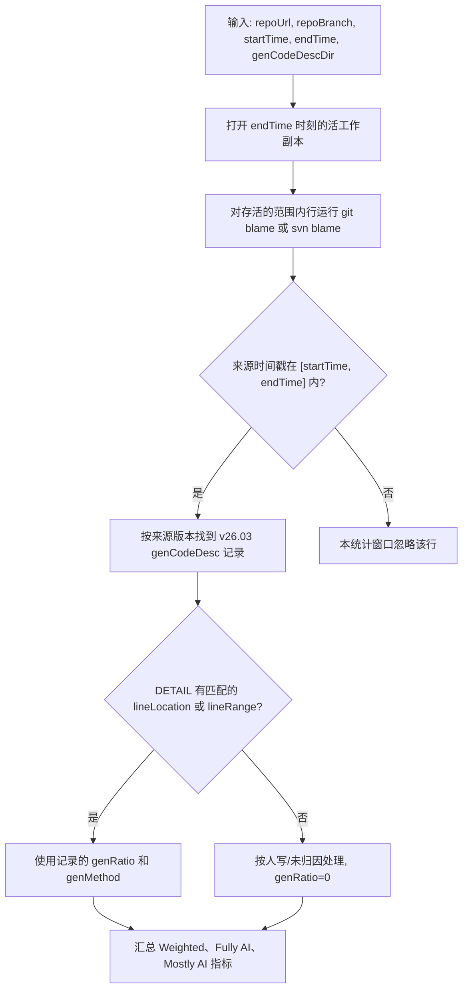
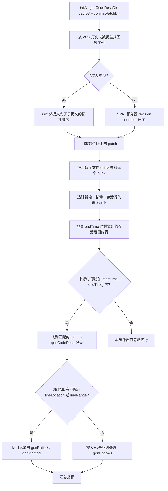
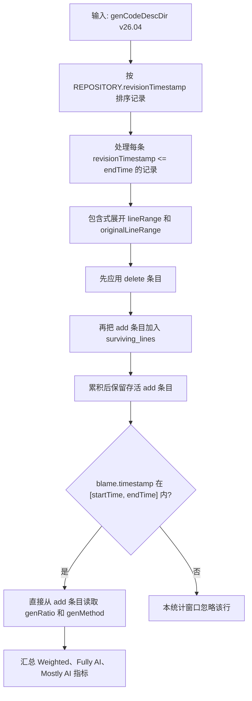

# 算法 A、B、C——是什么 & 为什么

## ======>>>共同目标<<<======

三种算法回答的是**同一个问题**：

> 对于 `endTime` 逻辑仓库快照中仍然存活、且当前文本形态由 `[startTime, endTime]` 内某个版本时间戳引入的范围内代码行或文档行，有多大比例归功于 AI？

三种算法的区别只在于**怎么发现行的来源**，不是度量对象不同。范围选择决定结果是只统计代码、只统计文档，还是两者都统计；行来源规则保持一致。

---

## ======>>>一眼看全貌<<<======

| | **算法 A** | **算法 B** | **算法 C** |
| --- | --- | --- | --- |
| **核心手段** | 在 `endTime` 实时跑 VCS blame | 按顺序离线回放 diff | genCodeDesc 里内嵌 VCS blame |
| **运行时要不要访问仓库** | 跑 blame 需要 | 如果已提供有序 patch 和顺序元数据，则不需要 | 不需要 |
| **用的 genCodeDesc 版本** | v26.03 | v26.03 | v26.04 |
| **需不需要逐提交的 diff 补丁** | 不需要 | 需要 | 不需要 |
| **处理顺序权威来源** | `endTime` 的活快照 | VCS 历史顺序 | `REPOSITORY.revisionTimestamp` |
| **正确性的权威来源** | 实时 VCS blame | 从 patch 重建的行血统 | codeAgent 写入时捕获的真实 VCS blame |
| **投产状态** | 生产质量 | 窄路径可用 | 计划中 |

---

## ======>>>算法 A——基于 Blame 的终态快照归属<<<======

### A：它是什么

算法 A 是**首选的、生产质量的基线方案**。它从 `endTime` 时刻的活文件快照出发，对每一条存活的范围内行运行 `git blame` 或 `svn blame`，用 blame 结果发现哪个版本最后引入了这行的当前文本形态。来源版本时间戳落在 `[startTime, endTime]` 窗口里的行会被计入。对每条计入的行，算法去匹配的逐版本 genCodeDesc v26.03 记录里查 `genRatio`；如果稀疏的 v26.03 `DETAIL` 没有匹配的行条目，则这行按人写/未归因处理，有效 `genRatio=0`。

### A：流程图



### A：为什么它行

- **直接回答** P0 度量问题，基于活快照。
- 改名和移动检测交给**成熟的 VCS blame 实现**，前提是所选 VCS 和选项支持。
- 逻辑风险低：blame 是**权威的**行来源，不需要部分重建。
- Git 和 SVN 都能用。

### A：已知坑

- 需要**活的仓库访问**——运行时必须有本地检出或等价工作副本。
- 在**非常大的仓库**里 blame 性能可能很慢，文件多、文件大的时候尤其明显。
- 正确性取决于 VCS blame 的质量——SVN 碰上复杂的 mergeinfo 可能返回不精确的结果。
- 要得到精确归因，每个被计入的来源版本都必须有对应的 v26.03 记录；否则按配置的缺失记录策略处理。

---

## ======>>>算法 B——不用 Blame 的增量式血统重建<<<======

### B：它是什么

算法 B 从 `--commitPatchDir` 回放一组按顺序排列的**逐版本 unified-diff patch**，增量式地重建行所有权。它不问 VCS“谁最后改了这一行？”，而是按 VCS 历史顺序模拟历史，打 diff 并追踪哪个版本引入了每一条存活行。知道存活行的来源版本后，算法去匹配的 v26.03 genCodeDesc 记录里查 `genRatio`；如果稀疏的 v26.03 `DETAIL` 没有匹配的行条目，则这行按人写/未归因处理，有效 `genRatio=0`。运行时**不需要实时 blame**；要完全离线运行，必须预先导出 patch 文件和提交/版本顺序元数据。

顺序是正确性契约的一部分：

- Git 回放顺序是 `repoBranch` 上父提交先于子提交的拓扑顺序；提交时间可以用于筛选窗口或打破平局，但不能覆盖父子顺序。
- SVN 回放顺序是在时间戳筛选后按服务器 revision number 升序。
- 目录遍历顺序、文件名排序、patch 文件修改时间都不是回放顺序。

### B：流程图



### B：为什么它存在

- 当 patch/顺序产物已准备好时，可以**离线分析**，不需要实时 blame 或网络访问。
- blame 跑太慢或者根本用不了的时候很有用。
- diff 产物可以**预索引、便宜地查询**。
- 能算出超出活快照归因之外的**历史过程度量**，例如写了又删的 AI 行、代码翻动率、存活率。
- 在测试环境里能做**确定性重放**。

### B：已知坑

- 实际上是在**重建一个部分 blame 引擎**——回放逻辑有任何缺口都会悄悄产生错误的归属。
- 每个被回放的版本都得有一个 unified-diff patch 文件。每个 patch 文件代表完整提交 diff：可以覆盖多个文件，每个文件 diff 又可以包含多个 hunk。每个文件区块和每个 hunk 都必须被回放。
- patch 顺序必须来自 VCS 历史元数据，不能来自文件系统。
- 合并感知的血统回放**很复杂**——合并多的历史要达到生产就绪需要认真做 TDD。
- SVN 的 path-copy 和 mergeinfo 语义引入的回放边界情况还没完全覆盖。
- 还是需要逐版本的 genCodeDesc v26.03——只是把 blame 那步省了。

---

## ======>>>算法 C——内嵌 Blame，纯 genCodeDesc<<<======

### C：它是什么

算法 C 是一个计划中的离线算法，运行时**不需要访问仓库**，也**不需要 diff 产物**。codeAgent 为每个版本写一个 v26.04 genCodeDesc 记录。每条记录只包含变更行：`changeType=add` 条目带 `genRatio`、`genMethod` 和真实 VCS blame；`changeType=delete` 条目用于标识要移除的精确来源行或来源行范围。下游消费者按 `REPOSITORY.revisionTimestamp` 排序记录，处理所有 `revisionTimestamp <= endTime` 的记录，在每条记录内部先应用 delete 再应用 add，包含式展开范围，并累积存活行集合。然后它用内嵌的 `blame.timestamp` 按 `[startTime, endTime]` 过滤存活 add 条目，并直接读取 `genRatio`。

### C：流程图



### C：为什么它存在

- 分析时**零 VCS 访问**——不用检出、不用子进程、不用网络。
- **零 diff 产物**——不需要 `commitPatchDir`。
- 每次提交的文件很小：只记变更的行，不是全量快照。
- 当 codeAgent 在写入时捕获了真实 VCS blame，Git 和 SVN 来源的 blame 都能用。
- 最适合**断网、边缘设备、大规模批处理**场景。

### C：已知坑

- 必须处理所有用于重建 `endTime` 前分支状态的 v26.04 记录，包括 `startTime` 之前的记录。链里缺一个记录，就会破坏存活行集合。
- `REPOSITORY.revisionTimestamp` 是**必须有的**，处理顺序靠它。
- 同一条记录内，不管数组顺序如何，都先应用 delete 条目，再应用 add 条目。
- Delete 条目必须用 `revisionId + originalFilePath + originalLine` 或 `revisionId + originalFilePath + originalLineRange` 引用**精确的 blame 来源**；不匹配的话会悄悄留下幽灵行。
- 嵌进去的 blame 必须是**真实的 VCS blame**，写入时抓的。合成的、推断的、手动编辑的 blame 会打破契约。
- 分析时没法用 VCS 独立验证——**正确性完全信任 codeAgent**。
- 如果 genCodeDesc 写了之后发生了 force-push 或 amend，嵌进去的 blame 就**悄悄过时了**。

---

## ======>>>不可替代的优势<<<======

每种算法有一个别人**替代不了**的东西：

- **算法 A** 在**权威性和可追责性**上不可替代——它是唯一直接依赖活 VCS blame 作为权威事实源的，能追溯回原始仓库证据。
- **算法 B** 在**基于补丁的历史重放**上不可替代——从同样的补丁产物做确定性重执行、历史窗口实验、过程重建，这些 A 和 C 做不到。
- **算法 C** 在**最小运行时依赖的离线可伸缩性**上不可替代——它同时做到了零仓库访问和零 diff 回放，这个部署优势其他两个做不到。

---

## ======>>>它们之间的关系<<<======

三种算法在相同场景下**语义等价**。选哪个取决于有什么条件、能接受什么取舍：

| 决策因素 | 选 A | 选 B | 选 C |
| --- | --- | --- | --- |
| 有活的仓库检出 | 是 | — | — |
| 需要权威的 VCS 证据 | 是 | — | — |
| 访问仓库贵或者不行 | — | 是 | 是 |
| 有预导出的 diff 补丁和顺序元数据 | — | 是 | — |
| 想要历史过程度量 | — | 是 | — |
| 要最少的运行时依赖 | — | — | 是 |
| 断网 / 边缘部署 | — | — | 是 |
| codeAgent 产出带内嵌 blame 的 v26.04 | — | — | 是 |

---

## ======>>>全局权衡<<<======

1–5 分，越高越好：

| 维度 | 算法 A | 算法 B | 算法 C |
| --- | --- | --- | --- |
| 低耦合 | 2 | 4 | 5 |
| 低复杂度 | 4 | 2 | 3 |
| 低存储占用 | 5 | 2 | 3 |
| 高可维护性 | 4 | 2 | 3 |
| 高可伸缩性 | 3 | 3 | 5 |
| 高容错性 | 3 | 2 | 3 |
| 正确性可解释性 | 5 | 3 | 3 |

---

## ======>>>出处<<<======

提炼自 [AggregateGenCodeDesc — README_IntroAlgABC.md](https://github.com/EnigmaWU/MyLLM_Arena/blob/main/MyStartups/AggregateGenCodeDesc/README_IntroAlgABC.md)。

---

## ======>>>附录：blame 是什么<<<======

三种算法都依赖**行来源归因**，通常也叫 **blame**——对文件里的任意一行，你可以问：**哪个版本最后引入了这一行的当前文本内容？**

blame 是**逐行的**，不是逐提交的。一个有 3 行的文件里，每行可能来自不同的版本：

```text
文件在 commit abc123 时：
  第 1 行: "int x = 0;"   → blame: revision 111aaa（3 个月前）
  第 2 行: "x += 1;"      → blame: revision 222bbb（1 周前）
  第 3 行: "return x;"    → blame: revision abc123（这次提交）
```

这就是为什么 blame 可以处理**改名**（在支持且配置正确时穿透文件路径变化追踪）、**合并**（遵循 VCS 对合并历史的 blame 规则）、和**重写**（指向引入当前文本的更新版本）。

每种算法怎么获取行来源归因：

| 算法 | 行来源 |
| --- | --- |
| A | 分析时实时跑 `git blame` / `svn blame` |
| B | 通过按顺序回放 diff 重建（重建的部分 blame） |
| C | codeAgent 写入时嵌进 v26.04 里的 |
